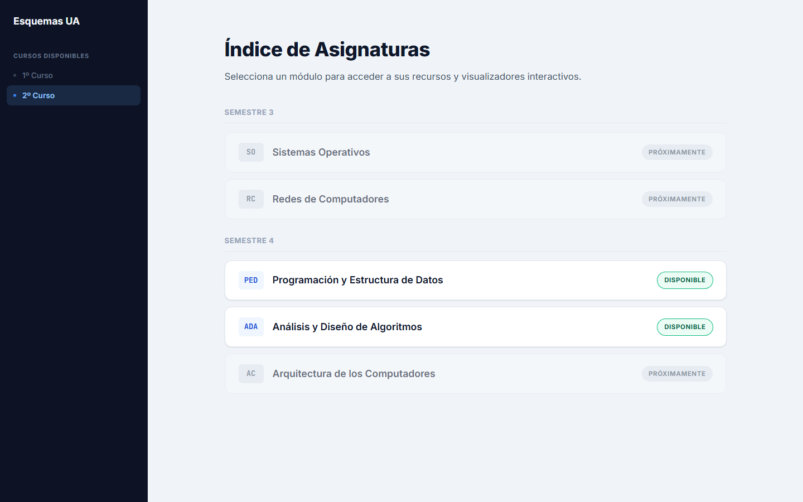
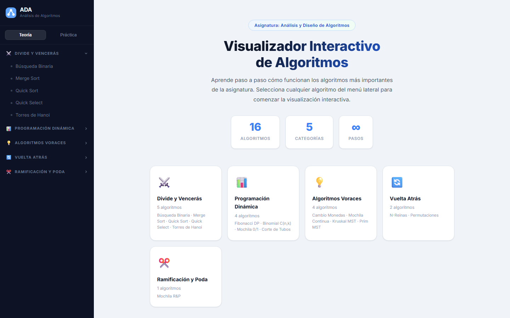
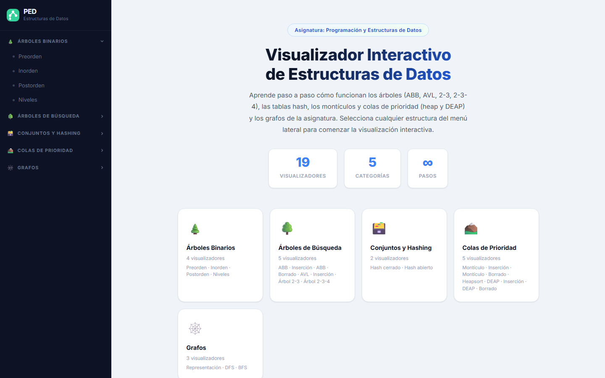

<div align="center">


<br/>
<br/>

<h1>🧩 Informatica Esquemas UA</h1>

<p align="center">
  <strong>Hub de esquemas, apuntes y visualizadores interactivos para el grado de Ingeniería Informática de la Universidad de Alicante.</strong><br/>
  Anima algoritmos y estructuras de datos paso a paso, con controles de reproducción, atajos de teclado y diseño responsive.
</p>

<br/>

[](https://github.com)
[](LICENSE)
[](#️-tech-stack)
[](#-contribuir)

</div>

---

## 📖 Tabla de Contenidos

- [Acerca del Proyecto](#-acerca-del-proyecto)
- [Características](#-características)
- [Tech Stack](#️-tech-stack)
- [Asignaturas Disponibles](#-asignaturas-disponibles)
- [Capturas de Pantalla](#-capturas-de-pantalla)
- [Inicio Rápido](#-inicio-rápido)
- [Estructura del Proyecto](#-estructura-del-proyecto)
- [Arquitectura del Visualizador](#-arquitectura-del-visualizador)
- [Cómo Añadir Contenido](#-cómo-añadir-contenido)
- [Contribuir](#-contribuir)
- [Licencia](#-licencia)

---

## 🎯 Acerca del Proyecto

**Informatica Esquemas UA** es un sitio web **100% estático** que centraliza esquemas, apuntes y *visualizadores interactivos* de las asignaturas del grado de Ingeniería Informática de la EPS (UA).

Funciona como un **hub**: una página índice lista las asignaturas por curso y semestre, y cada asignatura disponible enlaza a su propia mini-aplicación dentro de `subjects/`. El corazón de cada app es un **motor de reproducción genérico** que anima algoritmos y estructuras de datos **paso a paso**, permitiendo avanzar, retroceder, pausar y ajustar la velocidad para entender cada estado del cómputo.

> [!NOTE]
> Este proyecto está en constante crecimiento. La mayoría de asignaturas aún aparecen como *"Próximamente"*. Si quieres aportar visualizadores de tu asignatura, ¡los PRs son bienvenidos!

---

## ✨ Características

| Característica | Descripción |
|---|---|
| ▶️ **Reproducción paso a paso** | Avanza, retrocede, pausa y reinicia cada algoritmo como un reproductor de vídeo. |
| ⏱️ **Control de velocidad** | Ajusta el ritmo de la animación para seguir el algoritmo a tu tempo. |
| ⌨️ **Atajos de teclado** | Navega con `←` `→` y controla la reproducción con `Espacio`. |
| 🎬 **Pasos precalculados** | Todos los pasos se computan por adelantado: navegación instantánea sin recálculos. |
| 🧠 **Teoría y Práctica** | Alterna entre algoritmos teóricos y prácticas resueltas con distintas técnicas. |
| 🗂️ **Menú por categorías** | Algoritmos y estructuras agrupados por técnica de diseño en un sidebar navegable. |
| 📐 **Complejidades y notas** | Cada visualizador muestra coste temporal/espacial, descripción y casos de uso. |
| 🎨 **Estados coloreados** | Paleta consistente para resaltar elementos activos, comparados, ordenados, muros, caminos… |
| 📱 **Diseño Responsive** | Interfaz adaptada a móvil, tablet y escritorio. |
| ⚡ **Sin build ni dependencias** | HTML + CSS + JS vanilla: abre y funciona, sin `npm install` ni bundlers. |

---

## 🛠️ Tech Stack

Este proyecto es deliberadamente **minimalista**: sin frameworks, sin bundler, sin `package.json`.

| Tecnología | Propósito |
|---|---|
| **HTML5** | Estructura semántica de cada página y app de asignatura. |
| **CSS3** | Sistema de diseño con variables (`:root { --… }`) y estilos responsive. |
| **JavaScript (Vanilla)** | Motor de reproducción, renderizado de pasos y lógica de la UI. |
| [Google Fonts](https://fonts.google.com/) | Tipografías **Inter** y **JetBrains Mono** (única dependencia externa). |
| [Vercel](https://vercel.com/) | Hosting estático y Web Analytics. |

> [!TIP]
> Al no haber paso de *build*, cualquier cambio se ve al instante recargando el navegador.

---

## 📘 Asignaturas Disponibles

El hub organiza las asignaturas por curso y semestre. Estado actual:

| Código | Asignatura | Curso · Semestre | Estado |
|---|---|---|---|
| `ADA` | Análisis y Diseño de Algoritmos | 2º · S4 | ✅ **Disponible** |
| `PED` | Programación y Estructura de Datos | 2º · S4 | ✅ **Disponible** |
| `SO` | Sistemas Operativos | 2º · S3 | 🔜 Próximamente |
| `RC` | Redes de Computadores | 2º · S3 | 🔜 Próximamente |
| `AC` | Arquitectura de los Computadores | 2º · S4 | 🔜 Próximamente |
| `M1` | Matemáticas 1 | 1º · S1 | 🔜 Próximamente |

### 🔵 ADA — Algoritmos

Visualizador de algoritmos organizado por técnicas de diseño, con dos modos:

- **Teoría** — agrupada en **Divide y Vencerás**, **Programación Dinámica**, **Algoritmos Voraces**, **Vuelta Atrás** y **Ramificación y Poda**.
- **Práctica** — resuelve **el mismo laberinto** con cinco técnicas distintas (fuerza bruta, memoización, backtracking, voraz, y ramificación y poda), más un Bubble Sort.

### 🟢 PED — Estructuras de Datos

Visualizadores interactivos de estructuras y sus operaciones: **ABB** (inserción/borrado), **AVL** con rotaciones, **árboles 2-3 y 2-3-4**, **tablas hash** (dispersión abierta y cerrada), **montículos** (heap) y **Heapsort**, **DEAP**, y **grafos** (matriz de adyacencia, **DFS** y **BFS**).

---

## 📸 Capturas de Pantalla

<div align="center">
  
  <br/><em>Hub raíz — índice de asignaturas por curso y semestre</em>
  <br/><br/>
  
  <br/><em>AlgoVisual (ADA) — animación de un algoritmo paso a paso</em>
  <br/><br/>
  
  <br/><em>PED — visualización de una estructura de datos y sus operaciones</em>
</div>

> [!NOTE]
> Las imágenes son ilustrativas. Añade tus propias capturas en la carpeta `screenshots/`.

---

## 🚀 Inicio Rápido

No requiere instalación ni dependencias. Basta con **abrir el sitio en el navegador**.

### Opción A — Abrir directamente

Abre [`index.html`](index.html) en tu navegador con doble clic.

### Opción B — Servidor local (recomendado)

Las apps de asignatura cargan varios `.js` por rutas relativas, así que se recomienda un servidor estático:

```bash
# 1. Clona el repositorio
git clone https://github.com/tu-usuario/informatica-esquemas-ua.git

# 2. Accede al directorio del proyecto
cd informatica-esquemas-ua

# 3. Sirve la carpeta con un servidor estático
python -m http.server 8000
```

Abre `http://localhost:8000` en tu navegador. ¡Listo!

> [!TIP]
> Cualquier servidor estático vale: `python -m http.server`, `npx serve`, la extensión *Live Server* de VS Code, etc.

---

## 📂 Estructura del Proyecto

```
informatica-esquemas-ua/
├── index.html               # 🏠 Índice de asignaturas (hub raíz)
├── script.js                # Pestañas de curso + toast "no disponible"
├── styles.css               # Estilos del hub
└── subjects/
    ├── ADA/                 # 🔵 App AlgoVisual (Análisis y Diseño de Algoritmos)
    │   ├── index.html            # Layout: sidebar + visualizador; toggle Teoría/Práctica
    │   ├── script.js             # Motor AlgoVisualApp (reproducción, controles, sidebar)
    │   ├── algoritmos_data.js    # Datos de TEORÍA + helpers compartidos (legend, clone2D)
    │   ├── practicas_data.js     # Datos de las PRÁCTICAS (reutiliza helpers de teoría)
    │   └── styles.css
    └── PED/                 # 🟢 App de Estructuras de Datos
        ├── index.html
        ├── script.js
        ├── estructuras_data.js   # Datos de las estructuras y sus operaciones
        └── styles.css
```

El hub raíz y cada asignatura son **independientes**: comparten estética pero no código.

---

## 🧬 Arquitectura del Visualizador

El patrón central es un **motor de reproducción genérico** que consume "algoritmos" descritos como **datos**.

Cada algoritmo o estructura es un objeto con esta forma:

```js
{
  id, name, shortName,
  timeComplexity, spaceComplexity,
  description, detailedText, useCases,   // texto informativo (HTML)
  generateSteps(),                        // → array de "pasos" precalculados
  render(container, step)                 // pinta UN paso concreto en el DOM
}
```

- **`generateSteps()`** precalcula **todos** los pasos por adelantado. Cada paso es un objeto de estado con una descripción `desc` (HTML). Esto permite avanzar y retroceder sin recomputar nada.
- **`render(container, step)`** es una función **pura de pintado**: dado un paso, escribe el `innerHTML` del canvas. No guarda estado propio.
- **`AlgoVisualApp`** orquesta todo: construye el menú lateral, carga un algoritmo, guarda `steps`/`stepIdx` y maneja play/pausa/siguiente/anterior/reset/velocidad y los atajos de teclado.

Los algoritmos se registran en el objeto `ALGORITHMS` y se agrupan en el array `CATEGORIES` (que lista los `algoIds` de cada categoría). Las prácticas siguen el mismo patrón con `PRACTICAS_DATA` y `PRACTICAS`.

---

## ➕ Cómo Añadir Contenido

**Añadir un algoritmo de teoría a ADA:**

1. En [`subjects/ADA/algoritmos_data.js`](subjects/ADA/algoritmos_data.js), define `const ALGO_NUEVO = { … }` con `generateSteps()` y `render()`.
2. En [`subjects/ADA/script.js`](subjects/ADA/script.js), regístralo en `ALGORITHMS` con su `id`.
3. Añade su `id` a los `algoIds` de la categoría correspondiente en `CATEGORIES`.

> Los contadores de la pantalla de bienvenida se calculan solos desde `ALGORITHMS` / `CATEGORIES`.

**Añadir una práctica:** igual, pero en [`subjects/ADA/practicas_data.js`](subjects/ADA/practicas_data.js) usando `PRACTICAS_DATA` y `PRACTICAS`.

**Marcar una asignatura como disponible en el hub:** en [`index.html`](index.html), edita el `<a class="subject-item …">`: pon el `href` a `subjects/<CODIGO>/index.html`, quita la clase `muted` y el `onclick="showToast"`, añade la clase `active` y cambia el badge a `<span class="status-badge ready">Disponible</span>`.

**Crear una asignatura nueva:** duplica la estructura de `subjects/ADA/` en `subjects/<CODIGO>/` y adáptala. El enlace de vuelta al hub apunta a `../../index.html`.

---

## 🤝 Contribuir

Las contribuciones son lo que hace que la comunidad de código abierto sea un lugar increíble para aprender e inspirarse. **Cualquier contribución es muy bienvenida.**

1. Haz un **fork** del repositorio.
2. Crea una rama descriptiva:
   ```bash
   git checkout -b feature/visualizador-nuevo
   # o para correcciones:
   git checkout -b fix/descripcion-del-bug
   ```
3. Realiza tus cambios con commits atómicos y descriptivos:
   ```bash
   git commit -m "feat: añadir visualizador de Dijkstra en PED"
   ```
4. Sube los cambios a tu fork y abre un **Pull Request** hacia `main`.

### Guía de estilo

- Todo el texto de UI, comentarios y nombres de dominio va en **español**.
- Reutiliza las variables CSS (`:root { --… }`) y la paleta de estados existente en lugar de introducir colores sueltos.
- Los pasos de visualización renderizan HTML como *string* (`innerHTML`); reutiliza las clases CSS existentes.
- Usa siempre **rutas relativas**: el sitio debe poder servirse desde cualquier subdirectorio.
- Respeta el orden de los `<script>` en el HTML (los helpers compartidos deben cargarse antes que quien los usa).

> [!TIP]
> Al no haber CI ni linter, verifica siempre tus cambios manualmente en el navegador antes de abrir el PR.

---

## 📄 Licencia

Distribuido bajo la licencia **MIT**. Consulta el archivo [`LICENSE`](LICENSE) para más información.

---

<div align="center">

Hecho con ❤️ por estudiantes de la <a href="https://www.ua.es"><strong>Universidad de Alicante</strong></a>

<br/>

<sub>¿Encuentras un error? <a href="https://github.com/tu-usuario/informatica-esquemas-ua/issues/new">Abre un issue</a> · ¿Quieres contribuir? <a href="#-contribuir">Lee la guía</a></sub>

</div>
